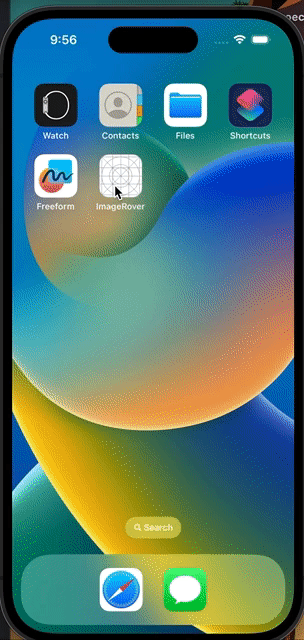

# Image Search Application

Welcome to the Image Search application—a user-friendly mobile application built using React Native, designed to search for images with the added benefit of automatic word correction suggestions.

## Table of Contents

- [Logic and Asssumption](#logic-and-assumptions)
- [Demo](#demo)
- [Setup and Installation](#setup-and-installation)

## Logic and Assumptions

The implementation is designed to suggest words that could potentially match a given "mistyped" word.

1. **Sanitize the word**
   Initially, any non-alphabetical characters are removed from the word to yield a cleaned-up version using regex.
2. **Fetch the required dictionary**
   This word is then examined to determine its length and whether it starts with a consonant or vowel. Based on its length, the code looks up potential matching words from the wordsDictionary. If the input word starts with a consonant, only words from the dictionary starting with the same consonant are considered.However, if the word starts with a vowel, the function fetches words that start with any vowel.
3. **Algorithm**
   To match the mistyped word with potential suggestions, the module then replaces all vowels in the word with an caret (\^). Words that undergo the same transformation and match the modified mistyped word are deemed as potential matches. When serving the final list of matches, if the cleaned-up input word is part of the potential matches, it is presented first, followed by up to three more suggestions. Otherwise, only the top four matches are returned. This helps users identify words they might have intended to type when they made an error.
4. **Assumption**
   I have built my algorithm based on the assumption that I have dictionary structured with word lengths as keys and that is further organised by the first letter of words.
5. **Alternative Approaches**

   1. Brute Force Approach: This is the most straightforward method. It involves iterating through the dictionary of words and, for each word, systematically replacing each vowel in the mistyped word with all possible vowel alternatives. The goal is to find a match between the corrected word and a word in the dictionary. While this approach works, it can be computationally expensive, especially for large dictionaries.

   2. Likeness Algorithm: In this approach, we employ a more nuanced method. We create a hash of vowels with their respective counts as keys, capturing the essence of the mistyped word. Then, we search the dictionary for words that have the highest likeness or similarity to the mistyped word based on this hash. Unlike the brute force approach, this method doesn't restrict replacements to vowels alone, allowing for more flexibility in finding the correct word

## Setup and Installation

1. **Prerequisites**:

   - Ensure you have [Node.js](https://nodejs.org/) and [npm](https://www.npmjs.com/) installed.
   - RequiredVerion:
     1. "node": ">=16"
     2. "ruby": "3.2.2"

2. **Install Project Dependencies**:

   - Navigate to your project directory and run:
     ```bash
     npm install
     ```

3. **Setting up the Development Environment**:

   - If you haven't already, set up the development environment for [iOS](https://reactnative.dev/docs/environment-setup) and/or [Android](https://reactnative.dev/docs/environment-setup).

4. **Start the Metro Server**:

- To start Metro, run the following command from the _root_ of your React Native project:

  ```bash
  # using npm
  npm start
  ```

5. **Start your Application**:

- Let Metro Bundler run in its _own_ terminal. Open a _new_ terminal from the _root_ of your React Native project. Run the following command to start your _Android_ or _iOS_ app:

  ### For Android

  ```bash
  # using npm
  npm run android
  ```

  ### For iOS

  ```bash
  # using npm
  npm run ios
  ```

## Demo

<div align="center">
  
</div>
